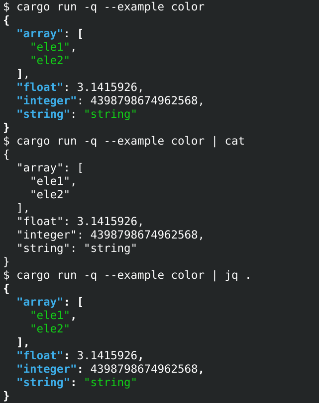

# Colored JSON output for Rust   

## Using

Add it to your project:

~~~toml
[dependencies]
colored_json = "3"
~~~

And then color your JSON output:

~~~rust
extern crate colored_json;

use colored_json::prelude::*;

fn main() -> ::std::result::Result<(), Box<::std::error::Error>> {
    println!(
        "{}",
        r#"
    {
        "array": [
            "ele1",
            "ele2"
        ],
        "float": 3.1415926,
        "integer": 4398798674962568,
        "string": "string"
    }
    "#.to_colored_json_auto()?
    );
    Ok(())
}
~~~

Or directly write it out:

~~~rust
extern crate serde_json;
extern crate colored_json;
use serde_json::{from_str, Value};
use std::io::stdout;
use std::io::Write;

pub fn main() -> ::std::result::Result<(), Box<::std::error::Error>> {
    let value: Value = from_str(r#"
        {
            "array": [
                "ele1",
                "ele2"
            ],
            "float": 3.1415926,
            "integer": 4398798674962568,
            "string": "string"
        }
    "#)?;
    let out = stdout();
    {
        let mut out = out.lock();
        colored_json::write_colored_json(&value, &mut out)?;
        out.flush()?;
    }
    Ok(())
}
~~~

